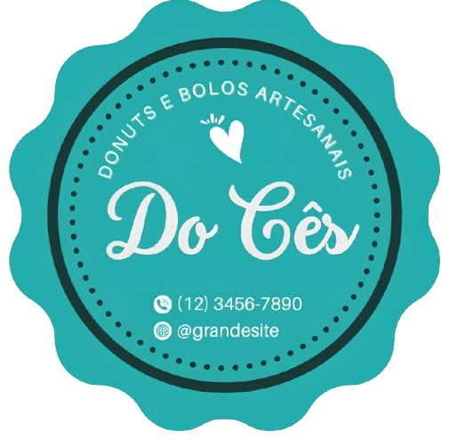
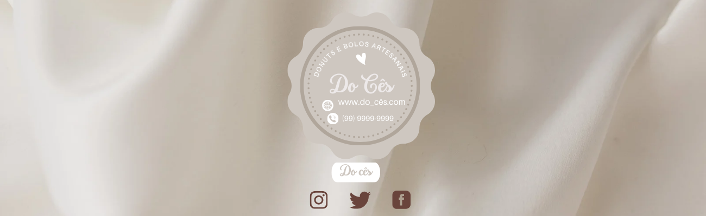

<p align="center">
  
</p>

<h1 align="center">Do Cês — Donuts & Bolos</h1>

<p align="center">
  Cardápio com carrinho e finalização via WhatsApp (projeto acadêmico).
</p>

<p align="center">
  <a href="#"></a>
  <a href="#"></a>
  <a href="#"></a>
  <a href="#"></a>
  <a href="#"></a>
  <a href="#"></a>
  <a href="#"></a>
</p>

---

## Preview
<p align="center">
  
  
</p>

---

## Destaques
- Carrossel de banners (altura máx. ~450px).
- Catálogo renderizado via `product.php` (nome, imagem, preço).
- Carrinho em JavaScript com totalização.
- Finalização via WhatsApp (`wa.me`) com mensagem do pedido.
- Seções “Kit festas”, “Localização” (mock de iPhone com Street View/Mapa) e “Equipe”.
- Estética baseada na paleta `#26b2a9` (primária) e `#1e3639` (fundo/containers).

## Como executar
Requisitos: PHP 7.4+.

```bash
git clone https://github.com/Vivito1/bolo.git
cd bolo
php -S localhost:8080
# Acesse http://localhost:8080
Alternativa: mover a pasta para htdocs (XAMPP) e acessar http://localhost/bolo.

Configuração rápida
WhatsApp (apenas dígitos: DDI+DDD+número) em script.js:

js
Copiar código
const WHATSAPP_NUMBER = "5599999999999"; // exemplo

function finalizarCompra() {
  // ...gera o texto do pedido...
  const msg = encodeURIComponent(textoPedido);
  window.open(`https://wa.me/${WHATSAPP_NUMBER}?text=${msg}`, "_blank");
}
Catálogo em product.php:

php
Copiar código
<?php
return [
  ['nome' => "Bolo de pote", 'preco' => 8.00, 'imagem' => "./img/boloCard.jpg"],
  ['nome' => "Donuts",       'preco' => 4.00, 'imagem' => "./img/donutsCard.jpg"],
];
Estrutura
bash
Copiar código
/img            # imagens do site, produtos e banners
index.php       # home (carrossel, catálogo, equipe, mapas)
product.php     # dados do cardápio (array PHP)
script.js       # carrinho + WhatsApp + interações
style.css       # estilos (cores: #26b2a9 / #1e3639)
docs/
  └─ screens/   # screenshots para o README (opcional)
<details> <summary>Diagrama</summary>
mermaid
Copiar código
flowchart LR
A[Browser] -- HTTP --> B[PHP (index.php)]
B --> C[(product.php)]
B --> D[JS: Carrinho/WhatsApp]
D -->|wa.me| E[WhatsApp]
B --> F[Google Maps Embed]
</details>
Licença
MIT. Consulte o arquivo LICENSE.

Autor
Victor Alves
